# avedit — Architecture Documentation

## High-Level Overview

avedit is a terminal-based Avro schema editor built with Go. It follows a **projection-command** architecture where the schema is parsed into a mutable tree (the projection), all edits happen through reversible command objects, and the UI reads the tree to render panels.

### Core Flow

```
.avsc file → JSON parse → Projection (tree) → UI renders
                                ↑                    |
                                |                    v
                            Commands ←──── User input (keys)
                                |
                                v
                          Projection → Serialize → .avsc file
```

1. **Load** — An `.avsc` JSON file is parsed into a `Projection`: a flat map of `Node` objects linked by parent/child IDs.
2. **Display** — The `TreeModel` flattens the projection into visible lines; `DetailsModel` shows editable attributes of the selected node.
3. **Edit** — User actions produce `Command` objects (factory functions) containing `Do()` and `Undo()` closures that mutate the projection in place.
4. **History** — Executed commands are pushed onto an undo stack (500 deep). Undo pops and calls `Undo()`; redo re-applies.
5. **Export** — The `emit` package walks the projection tree and reconstructs valid Avro JSON, then writes to file.

### Design Patterns

| Pattern | Application |
|---------|-------------|
| **Command** | All mutations are encapsulated in `Command{Do, Undo, Desc}` structs |
| **Elm Architecture** | Bubbletea's `Model → Update → View` loop; messages drive state transitions |
| **Projection/Source-of-Truth** | One mutable tree holds all state; UI and export derive from it |
| **Registry** | Themes are registered by name, loaded from JSON files on disk |
| **Overlay Stack** | Modal overlays (picker, confirm, help) sit above the panel layout |
| **Mode Machine** | Four modes (Normal, Edit, Search, Command) control input dispatch |

### Key Architectural Decisions

- **Flat node map** rather than nested struct tree — enables O(1) node lookup and simple parent/child rewiring.
- **Commands as closures** — captures old values at creation time for zero-copy undo.
- **No view-model separation per panel** — panels read directly from the projection to avoid sync bugs.
- **String-typed node IDs** (sequential `n1`, `n2`, …) — simple, debuggable, no UUID overhead.

---

## Architecture Diagram

```mermaid
graph TB
    subgraph Entry["Entry Point"]
        Main["cmd/avedit/main.go"]
    end

    subgraph IO["I/O Layer"]
        Load["io/load.go<br/>Parse .avsc → Projection"]
        Export["io/export.go<br/>Projection → .avsc"]
        Clip["io/clipboard.go<br/>System clipboard"]
    end

    subgraph Core["Core Engine"]
        Proj["projection/projection.go<br/>Node map + tree ops"]
        Node["projection/node.go<br/>Node struct + accessors"]
        Norm["projection/normalize.go<br/>Type classification"]
        Emit["projection/emit.go<br/>Tree → Avro JSON"]
        Clone["projection/clone.go<br/>Deep-copy subtrees"]
        Stats["projection/stats.go<br/>Field count + depth"]
        Valid["projection/validate.go<br/>Structural checks"]
    end

    subgraph Cmd["Command Layer"]
        Hist["command/command.go<br/>History + undo/redo"]
        Attr["command/attribute.go<br/>UpdateAttribute"]
        Create["command/create.go<br/>CreateNode"]
        Remove["command/remove.go<br/>RemoveNode"]
        Move["command/move.go<br/>MoveNode"]
        Copy["command/copy.go<br/>CopyNode"]
        Replace["command/replace.go<br/>ReplaceType"]
        Rename["command/rename_type.go<br/>RenameNamedType"]
    end

    subgraph Search["Search Engine"]
        Query["search/query.go<br/>Filter + score + rank"]
    end

    subgraph UI["TUI Layer (bubbletea)"]
        App["model/app.go<br/>Root model, mode dispatch"]
        Tree["model/tree.go<br/>Tree panel"]
        Det["model/details.go<br/>Details panel"]
        Expl["model/explorer.go<br/>File explorer"]
        SBar["model/statusbar.go<br/>Status bar"]
        Pick["model/picker.go<br/>Overlay picker"]
        Edit["model/editor.go<br/>Inline text editor"]
    end

    subgraph Theme["Theme System"]
        ThDef["theme/defaults.go<br/>Built-in dark theme"]
        ThLoad["theme/loader.go<br/>JSON → Theme"]
        ThReg["theme/loader.go<br/>Registry"]
    end

    subgraph Config["Configuration"]
        Cfg["config/config.go<br/>User prefs"]
        CfgH["config/history.go<br/>Persistent history"]
    end

    subgraph Schema["Type System"]
        Types["schema/types.go<br/>Kind constants, slots"]
        Templ["schema/templates.go<br/>New-node templates"]
    end

    Main --> Load
    Main --> App
    Load --> Proj
    Proj --> Node
    Proj --> Norm
    App --> Tree
    App --> Det
    App --> Expl
    App --> SBar
    App --> Pick
    App --> Hist
    Hist --> Attr
    Hist --> Create
    Hist --> Remove
    Hist --> Move
    Hist --> Replace
    Hist --> Rename
    Attr --> Proj
    Create --> Proj
    Remove --> Proj
    Move --> Proj
    Replace --> Proj
    Export --> Emit
    Emit --> Proj
    App --> Query
    Query --> Proj
    App --> ThReg
    ThReg --> ThLoad
    App --> Cfg
```



```mermaid
stateDiagram-v2
    [*] --> Normal
    Normal --> Edit : Enter on details / e
    Normal --> Search : /
    Normal --> Command : :
    Edit --> Normal : Enter (commit) / Esc (cancel)
    Search --> Normal : Esc / Enter (jump)
    Command --> Normal : Enter (exec) / Esc (cancel)

    state Normal {
        [*] --> TreeFocus
        TreeFocus --> DetailsFocus : Tab / Enter
        DetailsFocus --> TreeFocus : Tab / Esc
        TreeFocus --> ExplorerFocus : Tab (with explorer visible)
        ExplorerFocus --> TreeFocus : Tab
    }
```

---

## Low-Level Reference

### Entry Point

**`cmd/avedit/main.go`**

| Line | Function | Purpose |
|------|----------|---------|
| 18 | `main()` | CLI arg parsing, loads config, decides file-vs-directory mode |
| 49-60 | File mode | Calls `io.LoadAvroFromFile()` → `model.NewApp()` |
| 51 | Dir mode | Calls `model.NewAppExplorer()` (no schema loaded) |
| 62 | `tea.NewProgram(app).Run()` | Starts the bubbletea event loop |

### Projection Layer (`internal/projection/`)

**`projection.go`** — Core tree container

| Line | Function | Purpose |
|------|----------|---------|
| 10-13 | `Projection` struct | `RootID string`, `Nodes map[string]*Node` |
| 28-41 | `Register(node)` | Adds node to map, links to parent's Children slice |
| 44-61 | `Build(raw)` | Entry: creates schema node, calls `visitType` recursively |
| 63-109 | `visitType()` | Normalizes raw JSON, creates node, recurses into children |
| 111-123 | `visitField()` | Creates field node, visits its type child |
| 200-208 | `FindNamedRefs(refName)` | Scans all KindNamed nodes matching a reference string |
| 218-254 | `NamedTypesAndAliases()` | Collects named type names + aliases for picker categories |

**`node.go`** — Node structure

| Line | Function | Purpose |
|------|----------|---------|
| 48-55 | `Node` struct | ID, Kind, ParentID, Children []string, Path []any, Attrs |
| 57-61 | `Attributes` struct | `Native any` (raw Avro value), `Custom map[string]any` |
| 64-76 | `NewNode()` | Factory with sequential ID generation (`n1`, `n2`, …) |
| 95-103 | `NativeMap()` / `NativeString()` | Type-assert helpers for accessing raw data |
| 107-122 | `Name()` / `Namespace()` | Convenience getters from native map |
| 125-141 | `Aliases()` | Extracts `[]string` aliases from native map |

**Key insight:** KindNamed nodes store their reference as a plain string in `Attrs.Native` (e.g., `"Money"`). All other complex types store a `map[string]any`. This dual nature requires `NativeString()` vs `NativeMap()` checks throughout.

**`normalize.go`** — Type classification

| Line | Function | Purpose |
|------|----------|---------|
| 22-65 | `NormalizeType(typeVal any)` | Dispatches: string→Primitive/Named, []any→Union, map→complex |

This is the critical "routing" function that determines how raw JSON values map to node kinds. The logic:
- Plain string matching a primitive name → `KindPrimitive`
- Plain string not matching → `KindNamed` (reference to a named type)
- JSON array → `KindUnion`
- JSON object with `"type"` field → inspects the type value for record/array/map/enum/fixed

**`emit.go`** — Reconstruction

| Line | Function | Purpose |
|------|----------|---------|
| 10-16 | `GenerateAvro(proj)` | Entry: walks from root, calls `emitNode` |
| 18-41 | `emitNode()` | Switch on kind, delegates to type-specific emitters |
| 54-71 | `emitRecord()` | Copies native map (sans "fields"), rebuilds fields from children |
| 156-186 | `copyNativeMap()` | Shallow-copies native map, skips keys rebuilt from children |

**Critical pattern:** The emitter skips `fields`, `type`, `items`, `values` keys from the native map because those are reconstructed by walking the child nodes. This means edits to native map attributes are preserved, but structural changes must go through the tree.

### Command Layer (`internal/command/`)

**`command.go`** — History engine

| Line | Function | Purpose |
|------|----------|---------|
| 5-9 | `Command` struct | `DoFn`, `UndoFn func() error`, `Desc string` |
| 21-38 | `History` struct | `undoStack`, `redoStack []*Command`, `limit int` |
| 41-55 | `Execute(cmd)` | Calls `Do()`, pushes to undo, clears redo, enforces limit |
| 58-72 | `Undo()` | Pops undo, calls `Undo()`, pushes to redo |
| 75-89 | `Redo()` | Pops redo, calls `Do()`, pushes to undo |

**`attribute.go`** — Property edits

| Line | Function | Purpose |
|------|----------|---------|
| 19-80 | `UpdateAttribute()` | Captures old value at creation; Do sets new, Undo restores old |
| 90-138 | `DeleteAttribute()` | Removes key; Undo restores. Separate from Update for clarity |
| 148-177 | `RenameAttribute()` | Atomic key rename in native map (used for custom field key edits) |

**`rename_type.go`** — Named type propagation

| Function | Purpose |
|----------|---------|
| `RenameNamedType(proj, nodeID, oldName, newName)` | Updates the type's name AND all KindNamed refs matching old name (short or qualified) |
| `RenameAlias(proj, nodeID, oldAlias, newAlias)` | Updates alias in list AND all KindNamed refs using that alias |

**Tricky logic:** When a record's name changes from `"Money"` to `"Currency"`, any field whose type is `"Money"` or `"com.payment.Money"` must also update. The command searches for refs matching both the short name and `namespace.name`.

### TUI Layer (`internal/model/`)

**`app.go`** — Root orchestrator (~2000 lines)

| Area | Lines (approx) | Purpose |
|------|-----------------|---------|
| Type defs | 1-97 | AppMode, FocusPanel, Overlay, OverlayAction enums |
| App struct | 98-159 | All state: proj, history, mode, focus, overlays, search, command |
| Constructor | 162-230 | `NewApp()` — wires everything together |
| `Init()` | ~230 | Returns initial window-size command |
| `Update()` | ~240-350 | Main message dispatch: WindowSize, KeyPress, overlays |
| Key dispatch | ~350-650 | Per-mode key handling (search input, command input, normal keys) |
| Command exec | ~650-780 | `:w`, `:q`, `:export`, `:theme`, `:open`, `:notifications` |
| Normal-mode keys | ~780-1060 | Tree/details/explorer panel key routing |
| Overlay handlers | ~1060-1100 | Picker/confirm result dispatch |
| Picker factory | ~1081 | `typeCategoryPicker()` — builds Primitives/Complex/Named/Aliases categories |
| Detail commit | ~900-970 | `commitDetailEdit()` — applies edit, triggers rename propagation |
| `View()` | ~1600-1700 | Layout: panels side-by-side, status bar, overlays |
| Helpers | ~1700-2030 | `renderLineInput`, `formatNodePath`, `buildTypeSubtree` |

**Key area: `commitDetailEdit()` (~line 939)**
This is the most complex function. It:
1. Gets the edited value from the editor
2. Determines if it's a type change (triggers `ReplaceType`), name change (triggers `RenameNamedType`), alias change (triggers `RenameAlias`), or simple attribute update
3. Executes the appropriate command
4. Rebuilds tree lines and details

**`tree.go`** — Tree panel

| Line | Function | Purpose |
|------|----------|---------|
| 14-21 | `TreeLine` struct | Node pointer, depth, expanded flag, has-child flag |
| 22-36 | `TreeModel` struct | proj, theme, lines, cursor, offset, expanded map, matchedIDs |
| 39-49 | `NewTreeModel()` | Expands root + first level by default |
| ~65-110 | `rebuildLines()` | DFS walk → flat array with depth tracking |
| ~115-200 | `HandleKey()` | j/k/g/G/h/l/Space navigation |
| ~260-340 | `View()` | Renders visible window with badges, expanders, highlighting |
| ~340-460 | `nodeLabel()` | Kind-specific display: field shows name+type, named shows "→ref" |

**Badge rendering logic (`kindBadge`, `typeLabel`):**
Each node kind gets a colored text badge: `R` (record), `F` (field), `E` (enum), `A` (array), `M` (map), `()` (union), `X` (fixed), `→` (named ref). Styles come from the theme.

**`details.go`** — Attribute editor

| Line | Function | Purpose |
|------|----------|---------|
| 15-37 | `EditableAttr` struct | Key, Value, Kind (Text/Select/Multiline/ListItem/ListAdd/Readonly) |
| 44-59 | `DetailsModel` struct | node, attrs slice, cursor, editing state |
| ~70-200 | `buildAttrs()` | Constructs attribute rows from node's native map + custom map |
| ~200-320 | `HandleKey()` | j/k navigation; Enter/e to edit; a to add custom; d to delete |
| ~320-400 | `View()` | Renders key-value pairs with cursor highlighting |

**`editor.go`** — Inline text input

| Line | Function | Purpose |
|------|----------|---------|
| 10-17 | `Editor` struct | value []rune, cursor, active, width, style |
| 50-140 | `HandleKey()` | Arrows, backspace, delete, home/end, ctrl+backspace (word), char insert |
| ~130-135 | Character insert | Uses `msg.Text` (preserves case) with `msg.Code` fallback for tests |

**Tricky: uppercase input** — `msg.Code` always returns lowercase base key (`'a'` even for Shift+A). The fix uses `msg.Text` which contains the actual typed character with correct case.

**`picker.go`** — Overlay selector

| Line | Function | Purpose |
|------|----------|---------|
| 12-25 | `Picker` struct | items, cursor, filter, filtering, visible indices, separators map |
| 28-42 | `NewPicker()` | Simple flat list |
| 46-90 | `NewCategoryPicker()` | Groups items under labelled headers (non-selectable separators) |
| ~100-200 | `HandleKey()` | j/k nav (skips separators), `/` activates filter, Enter selects |
| ~250-280 | `applyFilter()` | Case-insensitive substring match; hides separators when filtering |

**`statusbar.go`** — Responsive status bar

| Line | Function | Purpose |
|------|----------|---------|
| 64-166 | `View()` | Budget allocation: mode badge + left (file + path) + right (undo + stats + help) |
| 110-119 | File truncation | Truncates from left: `"…filename.avsc"` |
| 122-149 | Path truncation | Truncates from left: `"…› parent › child"` (keeps deepest/rightmost segments) |

**Tricky:** The node path uses `" › "` (unicode) as separator (set in `formatNodePath`). The truncation logic must split on the same character.

**`explorer.go`** — File browser

| Line | Function | Purpose |
|------|----------|---------|
| 14-39 | `ExplorerModel` struct | rootDir, entries, cursor, filter state |
| ~55-95 | `rebuild()` | Scans directory tree, builds flat FileEntry list |
| ~95-200 | `HandleKey()` | Navigation, open file (Enter), parent dir (Backspace), filter (/) |
| ~430-450 | Search/filter | Recursive file matching with auto-expand of parent dirs |

### Search Engine (`internal/search/`)

**`query.go`**

| Line | Function | Purpose |
|------|----------|---------|
| 11-19 | `Filters` struct | Name, Type, Parent, Namespace, Alias, Text |
| 45-100 | `QueryNodes()` | Iterates all nodes, applies filters (AND logic), scores, sorts |
| ~100 | `ParseQuery()` | Splits input into prefix filters (`n:`, `t:`, `p:`, `ns:`, `a:`) and free text |
| ~150 | `scoreNode()` | Weighted scoring: name×3, type×2, text×1.5, alias×2.5 |

### Theme System (`internal/theme/`)

**`loader.go`**

| Line | Function | Purpose |
|------|----------|---------|
| 14-43 | `ThemeFile` struct | JSON structure with hex color strings |
| 46-56 | `LoadFile()` | Reads JSON, unmarshals, calls `Build()` |
| 59-150 | `Build()` | Converts hex strings → `color.Color` → lipgloss styles |
| 197-261 | `Registry` | Map of theme name → `*Theme`, loads from multiple dirs |

**Discovery order:** `./themes/` → next to executable → `~/.config/avedit/themes/`

### Configuration (`internal/config/`)

**`config.go`**

| Line | Function | Purpose |
|------|----------|---------|
| 12-15 | `Config` struct | `Theme string`, `ThemesDir string` |
| 26-35 | `Load()` | Reads `~/.config/avedit/config.json`, falls back to defaults |
| 60-73 | `Save()` | Writes config JSON to disk |
| 76-80 | `SetTheme()` | Load + update + save convenience |

**`history.go`**

| Line | Function | Purpose |
|------|----------|---------|
| 10-13 | `History` struct | `Commands []string`, `Searches []string` |
| 24-32 | `LoadHistory()` | Reads `~/.config/avedit/history.json` |
| 35-50 | `SaveHistory()` | Trims to 100 entries, writes JSON |

---

## Data Flow Examples

### Adding a field

```
User presses 'a' in tree panel (Normal mode)
  → app.go: dispatches to addField handler
    → typeCategoryPicker() builds picker with Primitives/Complex/Named/Aliases
    → Overlay switches to OverlayPicker
User selects "string" in picker
  → app.go: picker result handler
    → buildTypeSubtree("string") creates field node + primitive child
    → command.CreateNode(proj, params) produces Command
    → history.Execute(cmd) calls Do(), pushes to undo stack
    → tree.rebuildLines() refreshes display
    → statusbar.SetUndo(count) updates indicator
```

### Editing a field name

```
User navigates to field, presses Enter (→ details focus)
User navigates to "name" row, presses Enter/e
  → details.BeginEdit() stores oldValue, creates Editor
  → mode switches to ModeEdit
User types new name, presses Enter
  → commitDetailEdit() in app.go
    → Detects it's a "name" attribute on a record/field
    → command.UpdateAttribute(proj, {NodeID, "native", "name", newValue})
    → If this is a named type (record/enum/fixed), also calls:
      command.RenameNamedType(proj, nodeID, oldName, newName)
      → Updates all KindNamed refs throughout the schema
    → history.Execute(cmd)
    → mode returns to ModeNormal
```

### Save flow

```
User types ":w" + Enter (or ":w myfile.avsc" + Enter)
  → app.go: executeCommand("w myfile.avsc")
    → Resolves path relative to explorer's current directory
    → io.ExportAvroToFile(proj, resolvedPath)
      → projection.GenerateAvro(proj) walks tree → Avro JSON
      → json.MarshalIndent → os.WriteFile
    → Sets dirty=false, updates filePath
    → Flash message: "Saved: myfile.avsc"
```
